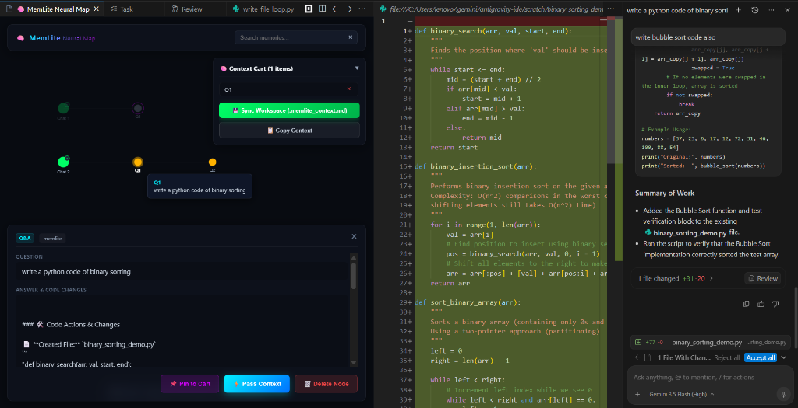

# 🧠 MemLite

Give your AI applications long-term memory in 5 lines. Local-first, private, and developer-friendly.

MemLite is a lightweight, local-first memory engine designed for LLM agents and assistants. It combines SQLite for structured metadata storage with FAISS for vector similarity search, enabling quick retention, retrieval, and decay of user memories.

It now includes a **VS Code Extension** that automatically tracks development chats, displays them in a visual mind map, and syncs workspace context.



---

## 🚀 Core Engine Features

- **Local-first & Private**: No cloud database setup required; everything runs on your local machine using SQLite and FAISS.
- **Hybrid Retrieval**: Ranks memories using semantic similarity, importance scoring, and recency decay.
- **Automatic Forgetting**: Simulates human memory by decaying unused or low-importance memories over time.
- **Auto-Categorization**: Dynamically classifies memories into categories like `Preference`, `Personal`, `Skill`, `Project`, and `Temporary`.
- **Integrations**: Drop-in wrapper for OpenAI's client to auto-inject memories, and native retriever for LangChain.

---

## 🖥️ VS Code Extension Features

- **Collapsible Mind Map:** Clusters previous chat sessions visually.
- **Interactive Hover Tooltips:** Sweep over nodes to instantly preview questions.
- **Context Cart:** Select and pin multiple memories/code changes across chat threads.
- **Workspace Markdown Sync:** Writes compiled context to `.memlite_context.md` at your workspace root, ready to be referenced in Copilot/Codex/Gemini via `#file:.memlite_context.md`.

---

## 📦 Installation

To install the core engine (SQLite only, works with API-based embeddings like OpenAI):
```bash
pip install memlite
```

To install local embedding and vector search capabilities (uses `sentence-transformers` and `faiss-cpu`):
```bash
pip install memlite[local]
```

Or install everything:
```bash
pip install memlite[all]
```

---

## 🛠️ Quick Start

```python
from memlite import Memory

# Initialize memory for a specific user
memory = Memory(user_id="user_123")

# Add memories
memory.add("User prefers dark mode")
memory.add("User is a backend developer using Python")

# Search/Retrieve memories
result = memory.search("What does the user prefer?")
print(result)
```

**Output:**
```json
{
  "memories": [
    "User prefers dark mode"
  ],
  "confidence": 0.92
}
```

---

## 📄 License

MIT License
